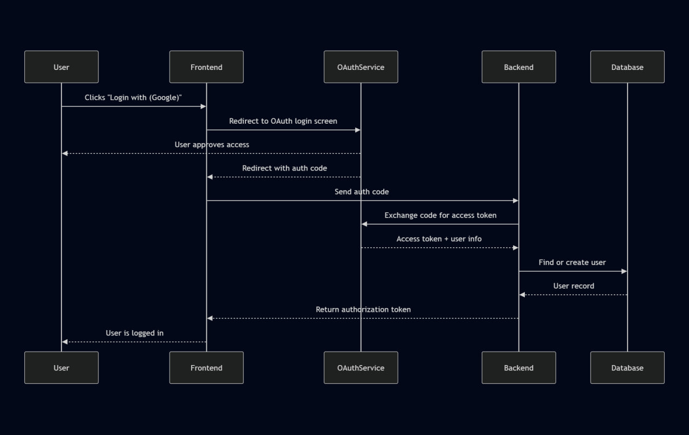

# AuthStanding

User authentication service built with Nest.js, designed to securely handle user registration, login, and profile access.

## API Reference

#### User Registration (Sign Up)

```
POST /users/signup
```

| Parameter  | Type     | Description                            |
| ---------- | -------- | -------------------------------------- |
| `username` | `string` | **Required**. User's unique username   |
| `password` | `string` | **Required**. User's password          |
| `email`    | `string` | **Required**. User's email address     |
| `fullName` | `string` | Optional. User's full name             |
| `birthday` | `string` | Optional. User's birthday (YYYY-MM-DD) |

**Response:** Returns created user data.

#### User Login (Sign In)

```
POST /users/signin
```

| Parameter  | Type     | Description                   |
| ---------- | -------- | ----------------------------- |
| `username` | `string` | **Required**. User's username |
| `password` | `string` | **Required**. User's password |

**Response:** Returns a JWT token as a string for authenticated sessions.

#### Get User Profile

```
GET /users/profile
```

**Headers:**

| Header          | Type     | Description                    |
| --------------- | -------- | ------------------------------ |
| `Authorization` | `string` | **Required**. Bearer JWT token |

**Response:** Returns user profile data.

## Running Locally

### Prerequisites

- Node.js (v16 or later)
- Docker & Docker Compose
- npm or yarn

---

### Steps

1. **Clone the repository**

```
git clone https://github.com/Mar88888888/AuthStanding.git
cd AuthStanding
```

2. **Install dependencies**

```
npm install
# or
yarn
```

3. **Configure environment variables**

Create a `.env` file in the root (if not present) and add necessary variables, (renaming `.env.example` from the repo into `.env` will work fine for local environment)

4. **Start PostgreSQL and Redis with Docker Compose**

```
docker-compose up -d
```

5. **Build the project**

```
npm run build
# or
yarn build
```

6. **Run the application**

```
npm run start:dev
# or for production
npm run start:prod
```

The API will be running at `http://localhost:3000`

## Running Tests

To run unit tests:

```
npm run test
```

To run end-to-end tests:

```
npm run test:e2e
```

## Scalability (Part 2)

This service is designed to scale efficiently for high traffic scenarios. To handle 1,000 user registrations and 100,000 logins per second, the system would run many stateless instances behind a load balancer to distribute requests evenly. Logins optimized by reading from a Redis cache, which speeds up authentication and reduces database load. To maintain reliability and speed at scale, techniques like database sharding and connection pooling can also be implemented in the future.

## Social Login Integration (Part 3)

Social login allows users to sign in using their existing accounts from services like Google, Facebook, or Twitter. To add this, the flow could look like this:

    1. The client redirects the user to the social provider’s login page.
    2. The user authenticates there and grants permission.
    3. The social provider redirects back with an authorization code or token.
    4. The client sends this token to our backend API.
    5. The backend verifies the token with the social provider to get user info.
    6. If the user is new, the backend creates a user record; if existing, it fetches it.
    7. The backend generates a JWT token and returns it to the client.

### Sequence Diagram

## 
